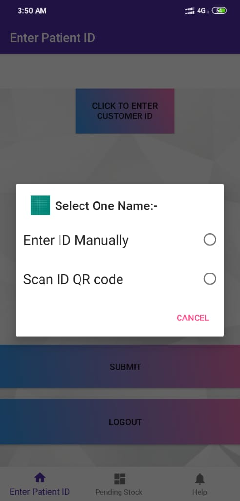
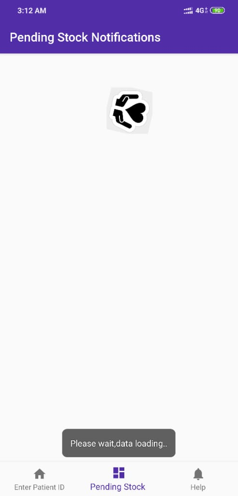

# med_track

## Commodity Tracker

## Purpose		

To aid the parents and the caretakers of disabled personnel who are limited in ability for movement, for getting the medicinal commodities at their doorstep without having to worry about the deadline of stock renewal.

## Scope

The periodically used commodities are tracked on the measure of the deadline for stock renewal and the customers do not have to worry about even having to order the stock  again .The stock replenition ,if done on a periodical(weekly/monthly) basis, several customers can be supplied by a single delivery system for delivering to all, which makes it cost effective ,since travelling charges for  a large number of customers in an area can be reduced,considering ,otherwise they would have to pursue means other than public transport .

## Requirements

An android device for the supplier to enter the details of the customer and the stock he buys.

Inputs:

 Supplier side-

* Sign up

* Log in

* Enter customer ID 

* Via manual text entry

* Via Scanning Qr code on the customer ID tag ,or stickered with the medicine

* If new user, enter user details, else ,add the new stock details.When the stock is being updated, the parameter dosage per duration can be the dosage per,day,week, or month of consumption.The calculation will be done according to the entered dosage per the duration.

* After entering the stock details,the pending stocks can be viewed using the pending stocks option,which regularly updates the remaining dates for stocks which need renewal in under 30 days.

	

Contributions welcomed.

         
